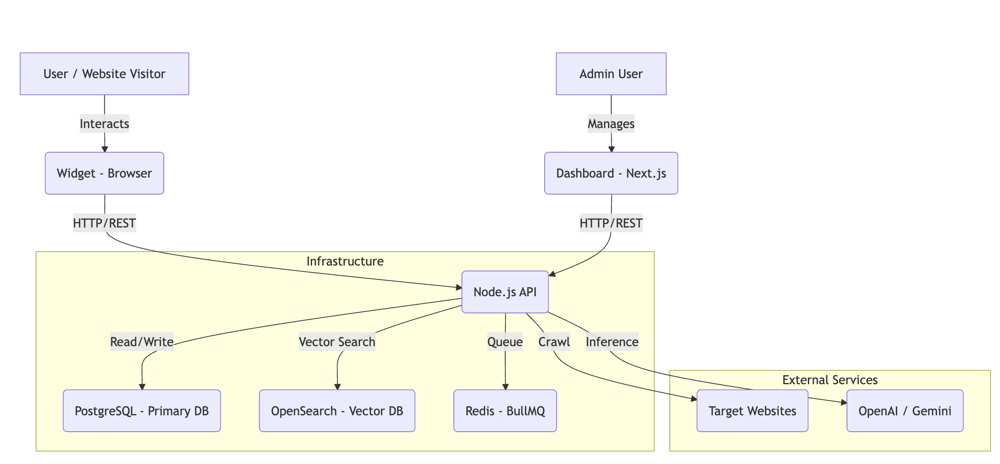
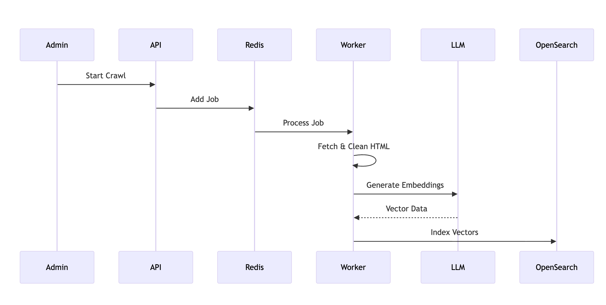

# Elasti System Architecture & Implementation Plan

## 1. Executive Summary
**Elasti** is a self-hosted Website Q&A Bot designed to ingest website content and provide intelligent answers using Large Language Models (LLMs). It leverages a modern microservices-based architecture to ensure scalability, flexibility, and ease of deployment.

## 2. System Architecture

The system is composed of three main application packages and three infrastructure services, orchestrated via Docker Compose.

### High-Level Architecture Diagram

### Core Components

1.  **API Service (`packages/api`)**
    -   **Runtime**: Node.js with TypeScript.
    -   **Framework**: Express.js.
    -   **Responsibilities**: 
        -   Handling project management and configuration.
        -   Crawling websites (using Puppeteer/Cheerio).
        -   Generating embeddings (using Gemini/OpenAI).
        -   Serving search queries and chat responses.
    -   **Key Libraries**: `bullmq` (Queues), `@opensearch-project/opensearch`, `openai`, `@google/generative-ai`.

2.  **Dashboard (`packages/dashboard`)**
    -   **Runtime**: Node.js (Next.js).
    -   **Framework**: Next.js 16 (App Router), React 19.
    -   **Styling**: Tailwind CSS v4.
    -   **Responsibilities**: User interface for creating projects, managing crawls, and viewing analytics.

3.  **Widget (`packages/widget`)**
    -   **Runtime**: Browser (bundled via Vite).
    -   **Framework**: Likely Preact or Vanilla JS (configured with Vite).
    -   **Responsibilities**: Embeddable chat interface for end-users to interact with the bot on 3rd party sites.

### 2.1 Data Isolation Strategy

| Layer | Status | Description |
|-------|--------|-------------|
| **Data Processing** | ✅ **Strictly Isolated** | OpenSearch documents are tagged with `project_id`. Search queries explicitly filter by this ID (`must: [{ term: { project_id } }]`), making cross-project data leakage impossible during retrieval. |
| **Access Control** | ❌ **Single Tenant** | The current `Project` model does not enforce ownership. Any admin with access to the Dashboard can view/manage all projects. **Action Required**: Implement User Auth & RLS (Row Level Security) in Phase 2 for SaaS use cases. |

## 3. Data Flow

### 3.1 Content Ingestion (Crawl & Index)

1.  **Trigger**: Admin initiates a crawl via Dashboard -> API.
2.  **Queue**: API pushes a crawl job to Redis (BullMQ).
3.  **Process**: Worker picks up job, fetches HTML from target URL.
4.  **Extract**: Text is extracted and cleaned.
5.  **Embed**: Text chunks are sent to LLM Provider for embedding generation.
6.  **Store**: Vectors are stored in OpenSearch; metadata in Postgres.

### 3.2 Query Resolution (Chat)

1.  **Input**: User asks a question via Widget.
2.  **Embed**: API sends question to LLM to get query vector.
3.  **Search**: API queries OpenSearch for relevant context chunks.
4.  **Synthesize**: API sends Context + Question to LLM.
5.  **Response**: LLM generates answer, returned to Widget.

## 4. Technology Stack & Requirements

| Component | Technology | Version |
|-----------|------------|---------|
| **Language** | TypeScript | 5.x |
| **Runtime** | Node.js | 20+ |
| **Database** | PostgreSQL | 15 (Alpine) |
| **Vector DB** | OpenSearch | 2.11 |
| **Cache/Queue**| Redis | 7 (Alpine) |
| **Frontend** | Next.js | 16 |
| **Styling** | Tailwind CSS | 4 |

## 5. Implementation Roadmap

### Phase 1: Stabilization (Current)
-   [x] Basic Monorepo Structure.
-   [x] Docker Compose Infrastructure.
-   [ ] **Verification**: Add end-to-end tests for the flow "Crawl -> Chat".
-   [ ] **Error Handling**: Improve resilience of the crawler against rate limits.

### Phase 2: Security & Multi-tenancy
-   [ ] **Auth**: Implement user authentication for Dashboard (e.g., NextAuth.js / Clerk).
-   [ ] **API Security**: Secure API endpoints with JWTs and API Keys for the widget.
-   [ ] **Sandbox**: Ensure creating a project doesn't expose data to other users (Row Level Security).

### Phase 3: Production Readiness
-   [ ] **CI/CD**: GitHub Actions for building and testing.
-   [ ] **Deployment**: Helm charts or AWS ECS task definitions.
-   [ ] **Monitoring**: Integrate OpenTelemetry for tracing requests across API and Workers.

## 6. Testing Strategy

To ensure reliability, the following testing layers are recommended:

1.  **Unit Tests**:
    -   API: Service logic (Embeddings, Crawler parsers).
    -   Dashboard: Component rendering.
    -   Command: `npm run test` (Vitest).

2.  **Integration Tests**:
    -   Test API endpoints with a real/mocked Database and Redis.
    -   Verify OpenSearch indexing.

3.  **E2E Tests**:
    -   Use Playwright to simulate a user visiting the dashboard, creating a project, and chatting with the widget.

## 7. Conclusion
Elasti is well-positioned as a scalable, modern solution for website Q&A. The separation of concerns between API, Crawler, and Vector Store allows for independent scaling. Immediate focus should be on **Authentication** and **Error Resilience** for the crawler.
